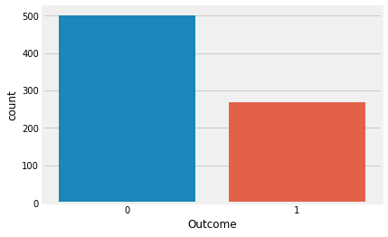
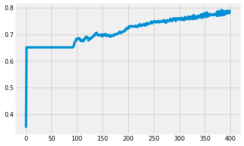

# EDA ET Creation de reseau de neurone pour PIMA Diabetes indias  
L'objectif des données est de prédire si un patient est diabétique ou non, en fonction de certaines mesures de diagnostic incluses dans l'ensemble de données.  
  
Les varaibles de la bases.  
**Grossesses**: Nombre de fois enceinte   
**Glucose**: La concentration de glucose plasmatique a 2 heures dans un test de tolérance au glucose par voie orale  
**Pression sanguine**: Tension artérielle diastolique (mm Hg)  
**SkinThickness**: Épaisseur du pli cutané des triceps (mm)  
**Insuline**: Insuline sérique 2 heures (mu U / ml)  
**IMC**: Indice de masse corporelle (poids en kg / (taille en m) ^ 2)  
**DiabetesPedigreeFunction**: Fonction pedigree du diabète  
**Âge**: Années  
**Résultat**: Variable de classe (0 ou 1)  


```python
# This Python 3 environment
import warnings
import numpy as np # Algebre lineaire 
import pandas as pd # lecture des donnees en CSV file I/O (e.g. pd.read_csv)
import seaborn as sns
import itertools 
import matplotlib.pyplot as plt
plt.style.use('fivethirtyeight')
#plt.style.use('seaborn-white')
#plt.style.use('seaborn')
import lightgbm as lgb
import matplotlib.pyplot as plt
from sklearn.metrics import mean_squared_error
from sklearn.metrics import roc_auc_score, roc_curve
from sklearn.model_selection import StratifiedKFold
warnings.filterwarnings('ignore')
from sklearn.model_selection import train_test_split
```


```python

# +-+-+-+-+-+-+-+-+-+-+-+-+-+-+-+-+-+-+-+-+-+-+-+-+-+-+-+-+-+-+-+-+-+-+-+-+-+-+-+-+-+-+-+-+-+-+-+-+-+-+-+-+-+-+-+-+-+-+-+-+-+- #
# On charge les donnees avec pandas.
df = pd.read_csv('pima.csv')
df.info()

df.isnull().sum() # Pas de donnees manquantes

diabetic=df[df['Outcome']==1]  # les personne diabetiques
nondiabetic=df[df['Outcome']==0] # les personnes non diabetics

# Distribution de la variables Outcome dans le base

sns.countplot(x='Outcome',data=df)
plt.show()
df['Outcome'].value_counts(1)  #len(df[df.Outcome == 1])/len(df['Outcome'])
# Nous avons plus de individus sains.
```

    <class 'pandas.core.frame.DataFrame'>
    RangeIndex: 768 entries, 0 to 767
    Data columns (total 9 columns):
    Pregnancies                 768 non-null int64
    Glucose                     768 non-null int64
    BloodPressure               768 non-null int64
    SkinThickness               768 non-null int64
    Insulin                     768 non-null int64
    BMI                         768 non-null float64
    DiabetesPedigreeFunction    768 non-null float64
    Age                         768 non-null int64
    Outcome                     768 non-null int64
    dtypes: float64(2), int64(7)
    memory usage: 54.1 KB





    0    0.651042
    1    0.348958
    Name: Outcome, dtype: float64


```python
# Correlation
corr = df.corr()
corr
```


<div>
<style scoped>
    .dataframe tbody tr th:only-of-type {
        vertical-align: middle;
    }

    .dataframe tbody tr th {
        vertical-align: top;
    }

    .dataframe thead th {
        text-align: right;
    }
</style>
<table border="1" class="dataframe">
  <thead>
    <tr style="text-align: right;">
      <th></th>
      <th>Pregnancies</th>
      <th>Glucose</th>
      <th>BloodPressure</th>
      <th>SkinThickness</th>
      <th>Insulin</th>
      <th>BMI</th>
      <th>DiabetesPedigreeFunction</th>
      <th>Age</th>
      <th>Outcome</th>
    </tr>
  </thead>
  <tbody>
    <tr>
      <th>Pregnancies</th>
      <td>1.000000</td>
      <td>0.129459</td>
      <td>0.141282</td>
      <td>-0.081672</td>
      <td>-0.073535</td>
      <td>0.017683</td>
      <td>-0.033523</td>
      <td>0.544341</td>
      <td>0.221898</td>
    </tr>
    <tr>
      <th>Glucose</th>
      <td>0.129459</td>
      <td>1.000000</td>
      <td>0.152590</td>
      <td>0.057328</td>
      <td>0.331357</td>
      <td>0.221071</td>
      <td>0.137337</td>
      <td>0.263514</td>
      <td>0.466581</td>
    </tr>
    <tr>
      <th>BloodPressure</th>
      <td>0.141282</td>
      <td>0.152590</td>
      <td>1.000000</td>
      <td>0.207371</td>
      <td>0.088933</td>
      <td>0.281805</td>
      <td>0.041265</td>
      <td>0.239528</td>
      <td>0.065068</td>
    </tr>
    <tr>
      <th>SkinThickness</th>
      <td>-0.081672</td>
      <td>0.057328</td>
      <td>0.207371</td>
      <td>1.000000</td>
      <td>0.436783</td>
      <td>0.392573</td>
      <td>0.183928</td>
      <td>-0.113970</td>
      <td>0.074752</td>
    </tr>
    <tr>
      <th>Insulin</th>
      <td>-0.073535</td>
      <td>0.331357</td>
      <td>0.088933</td>
      <td>0.436783</td>
      <td>1.000000</td>
      <td>0.197859</td>
      <td>0.185071</td>
      <td>-0.042163</td>
      <td>0.130548</td>
    </tr>
    <tr>
      <th>BMI</th>
      <td>0.017683</td>
      <td>0.221071</td>
      <td>0.281805</td>
      <td>0.392573</td>
      <td>0.197859</td>
      <td>1.000000</td>
      <td>0.140647</td>
      <td>0.036242</td>
      <td>0.292695</td>
    </tr>
    <tr>
      <th>DiabetesPedigreeFunction</th>
      <td>-0.033523</td>
      <td>0.137337</td>
      <td>0.041265</td>
      <td>0.183928</td>
      <td>0.185071</td>
      <td>0.140647</td>
      <td>1.000000</td>
      <td>0.033561</td>
      <td>0.173844</td>
    </tr>
    <tr>
      <th>Age</th>
      <td>0.544341</td>
      <td>0.263514</td>
      <td>0.239528</td>
      <td>-0.113970</td>
      <td>-0.042163</td>
      <td>0.036242</td>
      <td>0.033561</td>
      <td>1.000000</td>
      <td>0.238356</td>
    </tr>
    <tr>
      <th>Outcome</th>
      <td>0.221898</td>
      <td>0.466581</td>
      <td>0.065068</td>
      <td>0.074752</td>
      <td>0.130548</td>
      <td>0.292695</td>
      <td>0.173844</td>
      <td>0.238356</td>
      <td>1.000000</td>
    </tr>
  </tbody>
</table>
</div>


```python
# Randomise the data 
from sklearn.utils import shuffle
df = shuffle(df)
# Echantillon de train et  de test
seed = 123
X_train, X_test= train_test_split(df, test_size =0.25, random_state=seed)

app_X  = X_train[X_train.columns[:8]]
test_X = X_test[X_test.columns[:8]]

app_Y  = X_train['Outcome']
test_Y = X_test['Outcome']
```


```python

# +-+-+-+-+-+-+-+-+-+-+-+-+-+-+-+-+-+-+-+-+-+-+-+-+-+-+-+-+-+-+-+-+-+-+-+-+-+-+-+-+-+-+-+-+-+-+-+-+-+-+-+-+-+-+-+-+-+-+-+-+-+- #

# 1 ! Neural network

import keras 
import tensorflow as tf
from keras.models import Sequential 
from keras.layers import Dense
from keras.utils.vis_utils import plot_model

# Definisons les callback sur la base de loss pour l'arrete de l'entrainement
class myCallback(tf.keras.callbacks.Callback):
    def on_epoch_end(self, epoch, logs={}):
        if(logs.get('loss') < 0.5):
            print("\n Arret de l'entrainement avec car car loss est inferieur a .3")
            self.model.stop_training = True
          
          
# 2. Définir le modèle
# Les modèles de Keras sont définis comme une séquence de couches. Nous créons un modèle séquentiel et ajoutons des couches  
# une par une jusqu'à ce que notre topologie de réseau nous satisfasse soit 12, 8, 8, 8, 1.  


# create m
m = Sequential()
m.add(Dense(12, input_dim=8, init='uniform', activation='relu'))
m.add(Dense(8, init='uniform', activation='relu'))
m.add(Dense(8, init='uniform', activation='relu'))
m.add(Dense(8, init='uniform', activation='relu'))
m.add(Dense(1, init='uniform', activation='sigmoid'))
m.summary()

# 3. compilation et execution du modele
m.compile(loss='mean_squared_error' , optimizer='adam', metrics=['accuracy'])
callbacks = myCallback()
history = m.fit(app_X, app_Y, epochs=300, batch_size=len(app_X), verbose=1, callbacks=[callbacks])

```

    _________________________________________________________________
    Layer (type)                 Output Shape              Param #   
    =================================================================
    dense_26 (Dense)             (None, 12)                108       
    _________________________________________________________________
    dense_27 (Dense)             (None, 8)                 104       
    _________________________________________________________________
    dense_28 (Dense)             (None, 8)                 72        
    _________________________________________________________________
    dense_29 (Dense)             (None, 8)                 72        
    _________________________________________________________________
    dense_30 (Dense)             (None, 1)                 9         
    =================================================================
    Total params: 365
    Trainable params: 365
    Non-trainable params: 0
    _________________________________________________________________
    Epoch 1/400
    576/576 [==============================] - 0s 865us/step - loss: 0.2500 - acc: 0.3490
    Epoch 2/400
    576/576 [==============================] - 0s 4us/step - loss: 0.2499 - acc: 0.6510
    Epoch 3/400
    576/576 [==============================] - 0s 6us/step - loss: 0.2499 - acc: 0.6510
    Epoch 4/400
    576/576 [==============================] - 0s 9us/step - loss: 0.2498 - acc: 0.6510
    Epoch 5/400
    576/576 [==============================] - 0s 10us/step - loss: 0.2497 - acc: 0.6510
    Epoch 6/400
    576/576 [==============================] - 0s 4us/step - loss: 0.2496 - acc: 0.6510
    Epoch 7/400
   ....................................................................................
   
    576/576 [==============================] - 0s 7us/step - loss: 0.1460 - acc: 0.7830
    Epoch 399/400
    576/576 [==============================] - 0s 6us/step - loss: 0.1461 - acc: 0.7795
    Epoch 400/400
    576/576 [==============================] - 0s 7us/step - loss: 0.1461 - acc: 0.7917


```python
# le courbe de l'accuracy
plt.plot(history.history['acc'])
plt.show()
```





```python
# Evaluation du modele
scores = m.evaluate(test_X, test_Y)
print("\n%s: %.2f%%" % (m.metrics_names[1], scores[1]*100))
```

    192/192 [==============================] - 0s 47us/step
    
    acc: 76.56%

